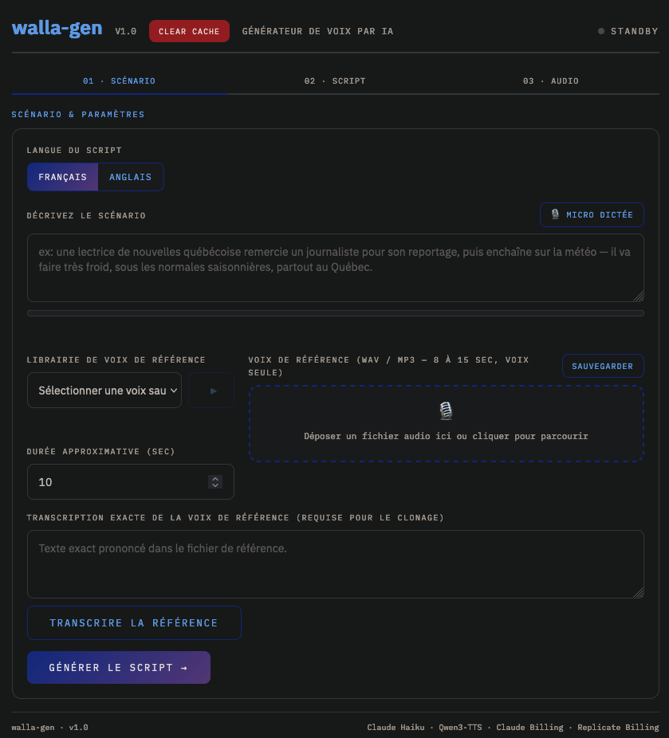

# walla-gen

**Version 2.0**



> **Language note:** The source code, user interface, status messages, and most internal documentation are written in French. The program can generate and clone speech in either Quebec French or English.

walla-gen is a local web application for script generation and voice cloning in Quebec French or English. It uses Anthropic to create scripts and performance directions, and Replicate to transcribe reference audio and generate WAV files.

## Current features

- Generates Quebec French or English scripts with `claude-haiku-4-5-20251001`.
- Automatically generates a short voice-performance direction.
- Performs voice cloning with Qwen3-TTS through Replicate.
- Peak-normalizes reference audio in a temporary copy before cloning, without denoising or filtering it; saved library files are never modified.
- Offers an optional Quebec-oriented text rewrite and a strengthened Quebec-accent instruction that explicitly rejects Metropolitan French prosody. Rewriting is disabled by default so the displayed script remains unchanged.
- Transcribes reference files with `openai/gpt-4o-mini-transcribe` through Replicate.
- Records audio from the browser microphone and transcribes it into the scenario field.
- Maintains a local voice library containing a name, audio file, and exact transcript for each voice.
- Plays saved voice references before generation.
- Lets you correct a saved voice's transcript or permanently delete the voice and its audio after confirmation.
- Marks each saved voice already used during the current browser session; these visual markers reset on page refresh or when the service is reopened.
- Filters the voice library according to the selected script language:
  - French: voices whose names begin with `FRAN`, plus voices without either the `FRAN` or `ENG` prefix.
  - English: voices whose names begin with `ENG`, plus voices without either the `FRAN` or `ENG` prefix.
  - Prefix matching is case-insensitive and ignores leading whitespace.
- Uses three clickable panels—Scenario, Script and Audio—so you can move freely through the workflow.
- Uses a warm, low-glare interface palette intended to be more comfortable during long or late-night sessions.
- Allows a running Qwen generation to be aborted from the Audio panel.
- Automatically and manually downloads the generated WAV file.
- Clears temporary files without affecting the saved voice library.
- Provides simultaneous HTTP and HTTPS access when HTTPS is configured.

## Current stack

- Python 3 and Flask/Werkzeug for the server.
- Framework-free HTML, CSS, and JavaScript in `templates/index.html`.
- Anthropic for script and performance-direction generation.
- Replicate for transcription and Qwen3-TTS.
- `cryptography` for creating local HTTPS certificates with `setup_https.py`.
- `ffmpeg` for reference-level normalization before voice cloning.
- PyManager as the startup manager on the current machine; direct startup is also supported.

Azure Speech, CosyVoice, Chatterbox, and Whisper are no longer part of the pipeline.

## Installation

```powershell
python -m venv .venv
.\.venv\Scripts\Activate.ps1
pip install -r requirements.txt
Copy-Item .env.example .env
```

At minimum, set `ANTHROPIC_API_KEY` and `REPLICATE_API_KEY` in `.env`.

`ffmpeg` must be available on `PATH`; set `FFMPEG_EXECUTABLE` when it is installed elsewhere.

The current `.env.example` values enable:

- HTTP on port `5050`;
- HTTPS on port `5051`;
- the `certs/walla-server.crt` and `certs/walla-server.key` certificate files;
- exact script preservation with `QUEBEC_TTS_REWRITE=false`;
- temporary peak normalization with `REFERENCE_AUDIO_NORMALIZATION=true`.

## Local HTTPS and microphone access

Microphone access from a remote browser requires a secure context. The setup script automatically detects the current LAN address. To generate certificates, run:

```powershell
.\.venv\Scripts\python.exe setup_https.py
```

Add `--force` only when replacing existing certificates. The script creates:

- `certs/walla-local-ca.crt`: the public certificate authority that must be installed as a trusted root CA on each client device;
- `certs/walla-server.crt`: the certificate presented by the server;
- `certs/walla-server.key`: the private server key, which must never be copied to client devices.

The public CA certificate can also be downloaded from:

`http://<server-lan-ip>:5050/local-ca.crt`

After installing the CA certificate on the client device, open:

`https://<server-lan-ip>:5051`

On the server computer itself, `https://localhost:5051` also works. On another device, `localhost` refers to that device—not to the server—so the server's LAN IP address must be used.

Generated certificates cover the detected LAN IP address, `127.0.0.1`, and `localhost`. They do not include the computer name. If the server's LAN IP address changes, regenerate the certificates with `setup_https.py --force` and install the new CA certificate on each client.

The previous firewall `.bat` scripts are no longer present. If Windows blocks access from another device, open PowerShell or Command Prompt as an administrator and run:

```text
netsh advfirewall firewall add rule name="walla-gen HTTP 5050" dir=in action=allow protocol=TCP localport=5050 profile=private,domain
netsh advfirewall firewall add rule name="walla-gen HTTPS 5051" dir=in action=allow protocol=TCP localport=5051 profile=private,domain
```

## Startup

To start the application directly:

```powershell
.\.venv\Scripts\python.exe app.py
```

With the HTTPS settings from `.env`, a single process simultaneously serves:

- `http://localhost:5050` on the server computer
- `https://localhost:5051` on the server computer
- `http://<server-lan-ip>:5050` from another LAN device
- `https://<server-lan-ip>:5051` from another LAN device

On the current machine, PyManager automatically starts the virtual-environment Python executable with `app.py` from the project directory.

## Usage

The user interface is in French. The main workflow is:

1. Select **Français** (French) or **Anglais** (English).
2. Describe the scenario or use microphone dictation.
3. Select a saved voice or provide a reference audio file.
4. Provide or generate the exact transcript of the reference audio.
5. Generate and edit the script.
6. Enter or automatically generate a voice-performance direction.
7. Keep or disable reference-level normalization. In French, the strengthened Quebec-accent option is also enabled by default.
8. Generate and download the WAV file. If Qwen gets stuck, open the **Audio** panel and select **Abort**.

Reference normalization creates a temporary mono 24 kHz WAV whose peak is adjusted to -3 dBFS. It applies no noise reduction or frequency filtering and does not overwrite uploaded files or anything in `voice_library/`. The Quebec-accent option is disabled automatically when English is selected.

Scenario microphone dictation currently uses a French transcription prompt even when English is selected. Reference-audio transcription does respect the selected language.

## Local data

- `voice_library/`: persistent voices and `index.json`; ignored by Git.
- `cache/input/` and `cache/output/`: temporary files; ignored by Git.
- `last-generation-debug.txt` and `last-transcription-debug.txt`: temporary diagnostic files; ignored by Git.
- `certs/`: local certificates and private key; ignored by Git.
- `.env`: secrets and local configuration; ignored by Git.

The **Clear Cache** button deletes cached files and both diagnostic files. It does not delete saved voices or certificates.

## Deployment limitations

The built-in Werkzeug server is suitable for this local/LAN use case, but the project is not configured as a public web service. It has no user accounts or route authentication. Do not expose ports 5050 or 5051 directly to the Internet.
